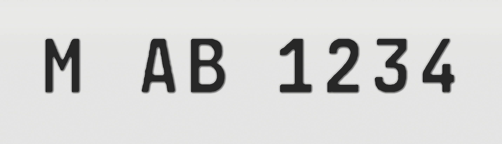

# kraftfahrzeugkennzeichenschirftart

A German license-plate style font (FE-Schrift Art) for Ubuntu Linux, traced from the alphabet reference in this repo. Includes `A–Z`, `Ä Ö Ü` (plus `ä ö ü`), `0–9` and space.

## Install

```bash
cp kraftfahrzeugkennzeichenschirftart.ttf ~/.local/share/fonts/
fc-cache -f ~/.local/share/fonts
```

Then select the family `kraftfahrzeugkennzeichenschirftart` in any app.

## 3D stamp effect

TrueType stores flat outlines, so the embossed-plate look is applied at render time:

```bash
python3 render_3d_text.py "M-AB 1234" my_plate.png
```



## Rebuild the font

```bash
python3 build_font.py   # needs: pillow, numpy, potrace, fonttools
```

## Files

| File | What |
| ---- | ---- |
| `kraftfahrzeugkennzeichenschirftart.ttf` | The font (Regular) |
| `build_font.py` | Segments the reference alphabet, vectorizes with Potrace, builds the TTF |
| `render_3d_text.py` | Renders any text with the 3D stamp effect |
| `make_3d*.py` | Earlier photorealistic plate experiments |
| `proof.png` | Flat proof of all glyphs |
